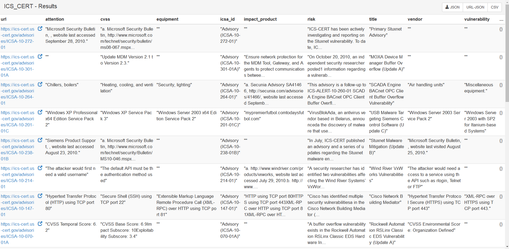
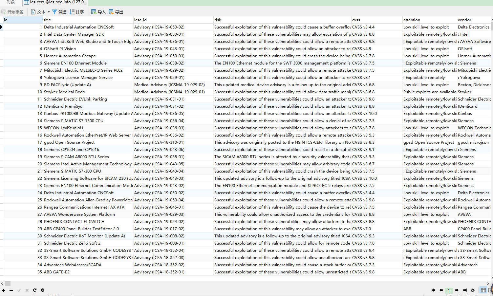
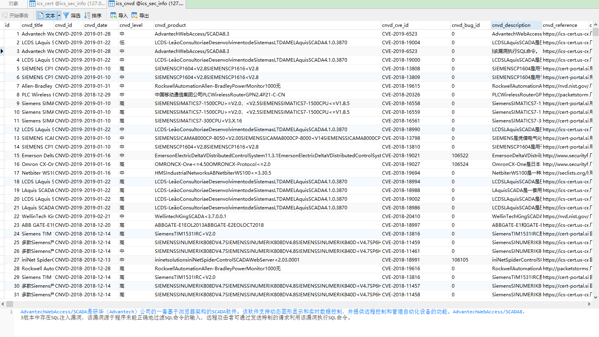
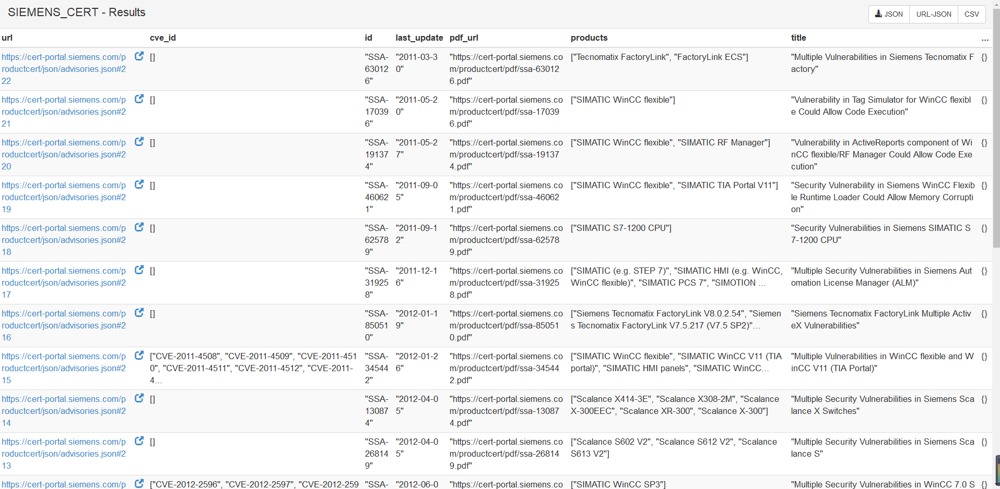
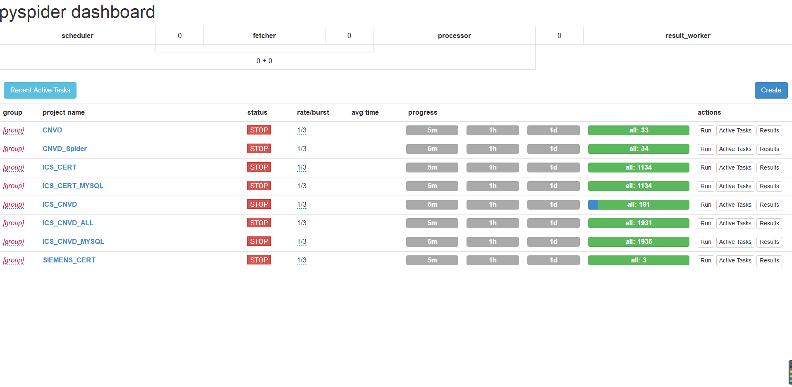

# PySpider-ICS

### 说明

此项目用来记录使用pyspider爬虫框架爬取工控相关数据(漏洞、预警、安全事件等)

数据来源如下

#### 美国工控系统网络应急响应小组(*ICS-CERT*)

https://ics-cert.us-cert.gov/advisories

#### CNVD-工控系统行业漏洞

http://ics.cnvd.org.cn

####  Siemens ProductCERT

https://new.siemens.com/global/en/products/services/cert.html#SecurityPublications

针对西门子CERT，直接对其https://cert-portal.siemens.com/productcert/json/advisories.json的json数据接口进行解析，额外查询了pyspider对json数据解析的方法：http://docs.pyspider.org/en/latest/apis/self.send_message/

*利用send_message，将单个页面的多个结果，for循环后，每个dict结果，都调用send_message去发送message给自己的项目，在收到message的地方，再返回dict结果。*

#### 工业互联网安全应急响应中心

https://www.ics-cert.org.cn/

暂时这么多，其他需要再添加